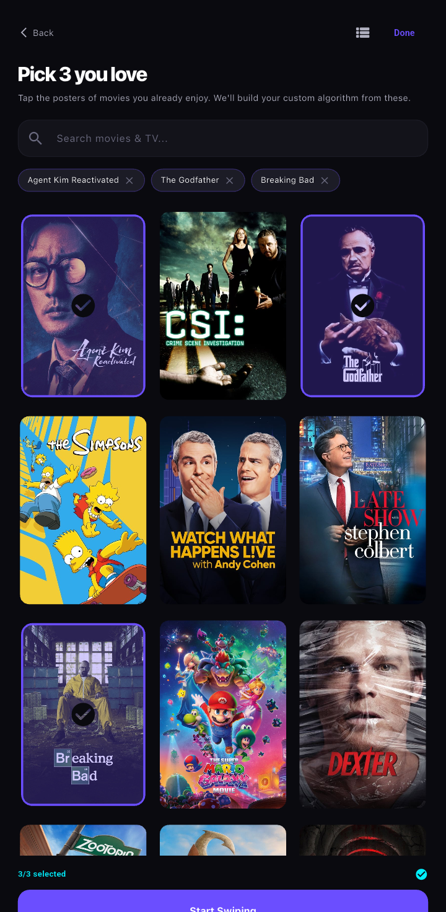
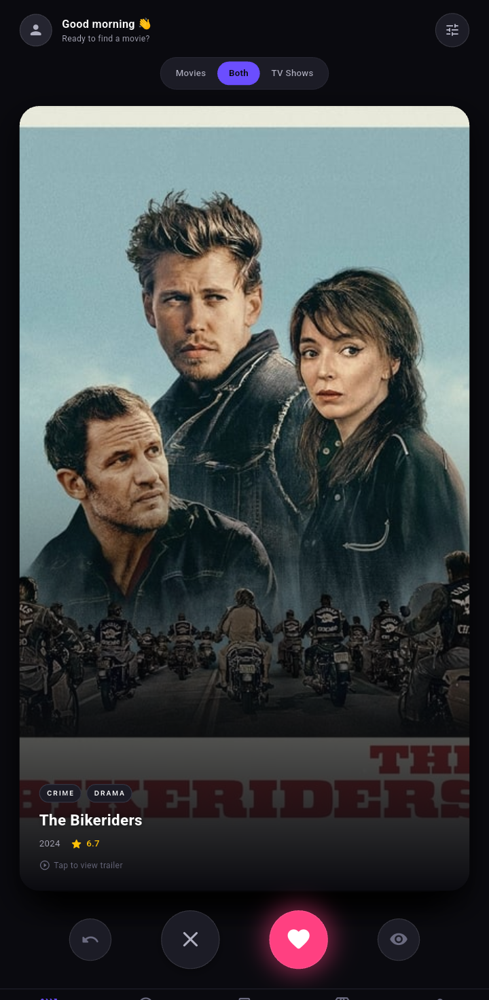
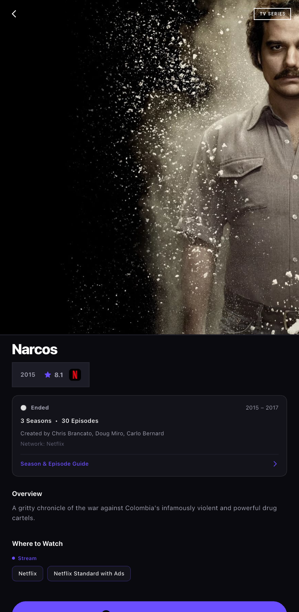
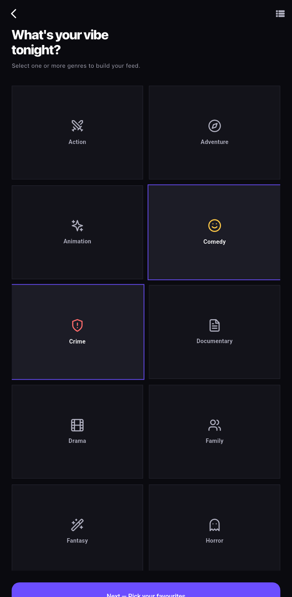
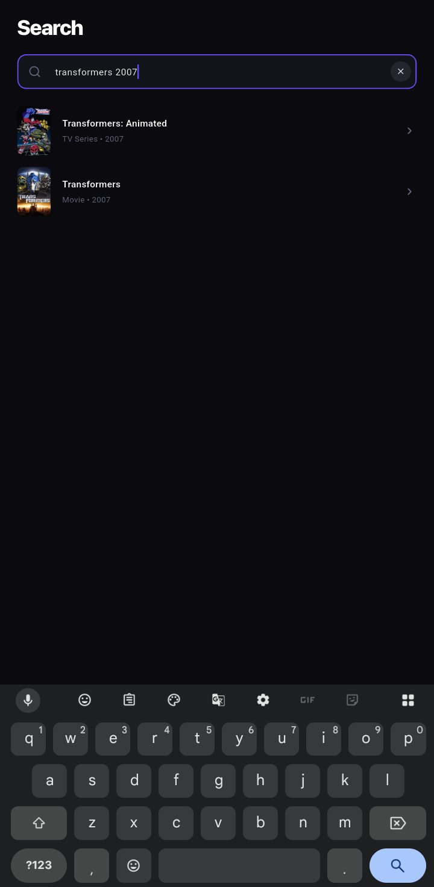
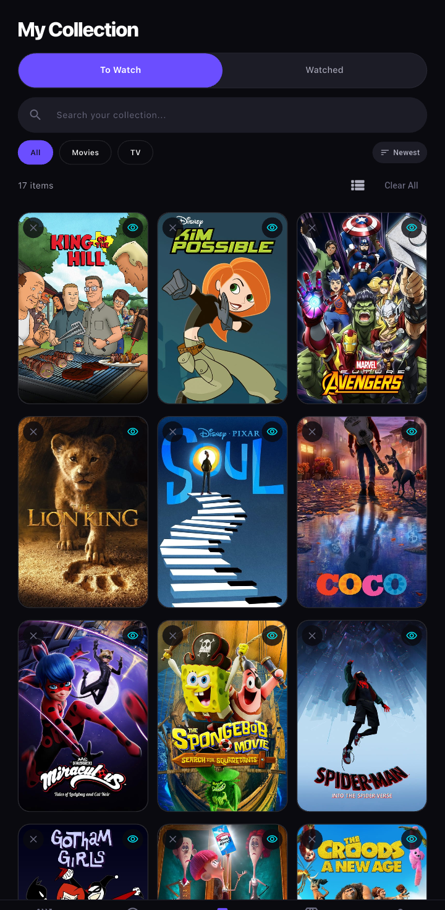
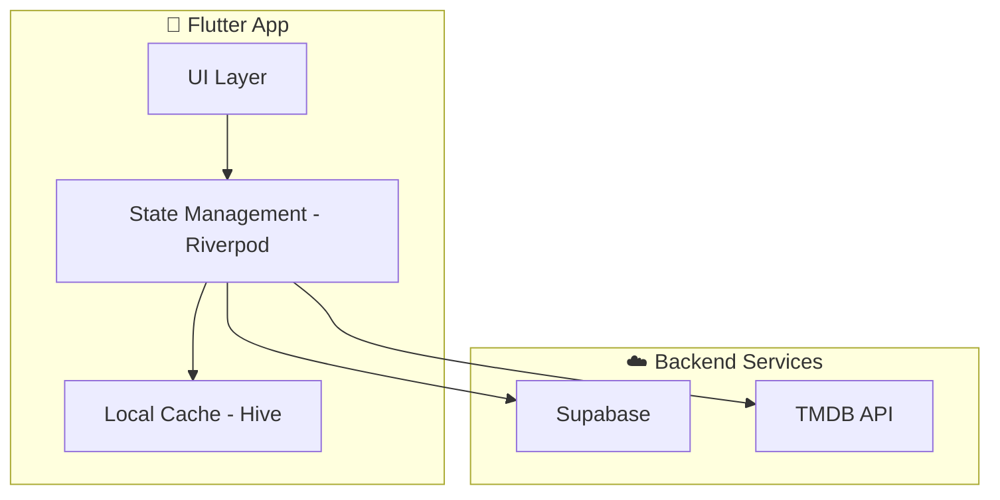

<a id="readme-top"></a>

<!-- PROJECT SHIELDS -->
<div align="center">
  
  
  
  
</div>

<!-- PROJECT LOGO -->
<br />
<div align="center">
  <a href="https://github.com/J-Derek/pickd">
    
  </a>

  <h3 align="center">Pickd</h3>

  <p align="center">
    <strong>Stop scrolling. Start watching.</strong>
    <br />
    A premium, mood-based movie discovery app that curates personalized recommendations tailored precisely to your current vibe.
    <br />
    <br />
    <a href="https://github.com/J-Derek/pickd/releases"><strong>Download APK »</strong></a>
    <br />
    <br />
    <a href="https://github.com/J-Derek/pickd/issues">Report Bug</a>
    ·
    <a href="https://github.com/J-Derek/pickd/issues">Request Feature</a>
  </p>
</div>

---

<!-- TABLE OF CONTENTS -->
<details>
  <summary>Table of Contents</summary>
  <ol>
    <li>
      <a href="#about-the-project">About The Project</a>
      <ul>
        <li><a href="#app-preview">App Preview</a></li>
        <li><a href="#built-with">Built With</a></li>
      </ul>
    </li>
    <li>
      <a href="#getting-started">Getting Started</a>
      <ul>
        <li><a href="#prerequisites">Prerequisites</a></li>
        <li><a href="#installation">Installation</a></li>
      </ul>
    </li>
    <li><a href="#features--usage">Features & Usage</a></li>
    <li><a href="#architecture">Architecture</a></li>
    <li><a href="#roadmap">Roadmap</a></li>
    <li><a href="#contributing">Contributing</a></li>
    <li><a href="#license">License</a></li>
    <li><a href="#acknowledgments">Acknowledgments</a></li>
  </ol>
</details>

---

<!-- ABOUT THE PROJECT -->
## About The Project

Endless scrolling on streaming platforms is broken. **Pickd** fixes this by instantly curating movies and TV shows based entirely on your **current mood** and **vibe**. Using a fluid, Tinder-style swipe interface, you make split-second decisions without overthinking, saving them instantly to a cross-device synced watchlist.

<p align="right">(<a href="#readme-top">back to top</a>)</p>

### App Preview

| Swipe | Detail | Watchlist |
|:---:|:---:|:---:|
|  |  |  |

| Mood Selection | Search | Profile |
|:---:|:---:|:---:|
|  |  |  |

<p align="right">(<a href="#readme-top">back to top</a>)</p>

### Built With

This project is built using modern frameworks and robust backend services.

* 
* 
* 
* 

<p align="right">(<a href="#readme-top">back to top</a>)</p>

---

<!-- GETTING STARTED -->
## Getting Started

To get a local copy up and running, follow these simple steps.

### Prerequisites

Make sure you have the following installed on your machine:
* [Flutter SDK](https://docs.flutter.dev/get-started/install) (v3.0.0 or higher)
* [Dart SDK](https://dart.dev/get-dart)
* A TMDB API Key from [The Movie Database](https://www.themoviedb.org/documentation/api)
* A [Supabase](https://supabase.com/) project

### Installation

1. **Clone the repo**
   ```sh
   git clone https://github.com/J-Derek/pickd.git
   ```
2. **Navigate into the directory**
   ```sh
   cd pickd
   ```
3. **Install Flutter packages**
   ```sh
   flutter pub get
   ```
4. **Configure Environment Variables**
   Rename the `.env.example` file to `.env` and enter your API keys:
   ```env
   TMDB_API_KEY=your_tmdb_api_key_here
   SUPABASE_URL=your_supabase_url_here
   SUPABASE_ANON_KEY=your_supabase_anon_key_here
   ```
5. **Run Code Generation** (For Riverpod and Freezed models)
   ```sh
   dart run build_runner build --delete-conflicting-outputs
   ```
6. **Run the App**
   ```sh
   flutter run
   ```

<p align="right">(<a href="#readme-top">back to top</a>)</p>

---

<!-- USAGE EXAMPLES -->
## Features & Usage

| Feature | Description |
| :--- | :--- |
| 🎭 **Mood-Based Engine** | Select your current vibe (e.g., *Chill, Hyped, Spooky*) and let Pickd instantly generate the perfect deck of films. |
| ⚡ **Tinder-Style Swiping** | Fluid gesture controls. **Swipe Right** to save to Watchlist, **Swipe Left** to pass, **Swipe Up** to mark as watched. |
| 🎬 **Premium Cinematic UI** | A stunning, edge-to-edge dark mode interface designed using modern HCI principles. |
| ☁️ **Cross-Device Sync** | Powered by **Supabase**. Your watchlist, history, and profile sync instantly across all your devices. |
| 📱 **Offline Caching** | Powered by **Hive**. Blazing fast local storage ensures your app loads instantly, even on terrible networks. |

<p align="right">(<a href="#readme-top">back to top</a>)</p>

---

<!-- ARCHITECTURE -->
## Architecture

Pickd is built with a feature-first, scalable domain architecture:



<p align="right">(<a href="#readme-top">back to top</a>)</p>

---

<!-- ROADMAP -->
## Roadmap

- [x] Mood-based swiping engine
- [x] TV Series support with season/episode browser  
- [x] Hidden Gems discovery deck
- [x] Cross-device sync via Supabase
- [ ] Multiplayer swiping rooms (watch with friends)
- [ ] Streaming provider deep links (Netflix, Prime, Disney+)
- [ ] iOS release

See the [open issues](https://github.com/J-Derek/pickd/issues) for a full list of proposed features (and known issues).

<p align="right">(<a href="#readme-top">back to top</a>)</p>

---

<!-- CONTRIBUTING -->
## Contributing

Contributions are what make the open source community such an amazing place to learn, inspire, and create. Any contributions you make are **greatly appreciated**.

If you have a suggestion that would make this better, please fork the repo and create a pull request. You can also simply open an issue with the tag "enhancement".

1. Fork the Project
2. Create your Feature Branch (`git checkout -b feature/AmazingFeature`)
3. Commit your Changes (`git commit -m 'Add some AmazingFeature'`)
4. Push to the Branch (`git push origin feature/AmazingFeature`)
5. Open a Pull Request

<p align="right">(<a href="#readme-top">back to top</a>)</p>

---

<!-- LICENSE -->
## License

Distributed under the MIT License. See `LICENSE` for more information.

<p align="right">(<a href="#readme-top">back to top</a>)</p>

---

<!-- ACKNOWLEDGMENTS -->
## Acknowledgments

* [The Movie Database (TMDB)](https://www.themoviedb.org/) for their incredible, comprehensive movie and TV API.
* [Flutter Card Swiper](https://pub.dev/packages/flutter_card_swiper) for the buttery-smooth tinder card physics.
* [Othneil Drew's README Template](https://github.com/othneildrew/Best-README-Template) for the structured documentation inspiration.

<p align="right">(<a href="#readme-top">back to top</a>)</p>
