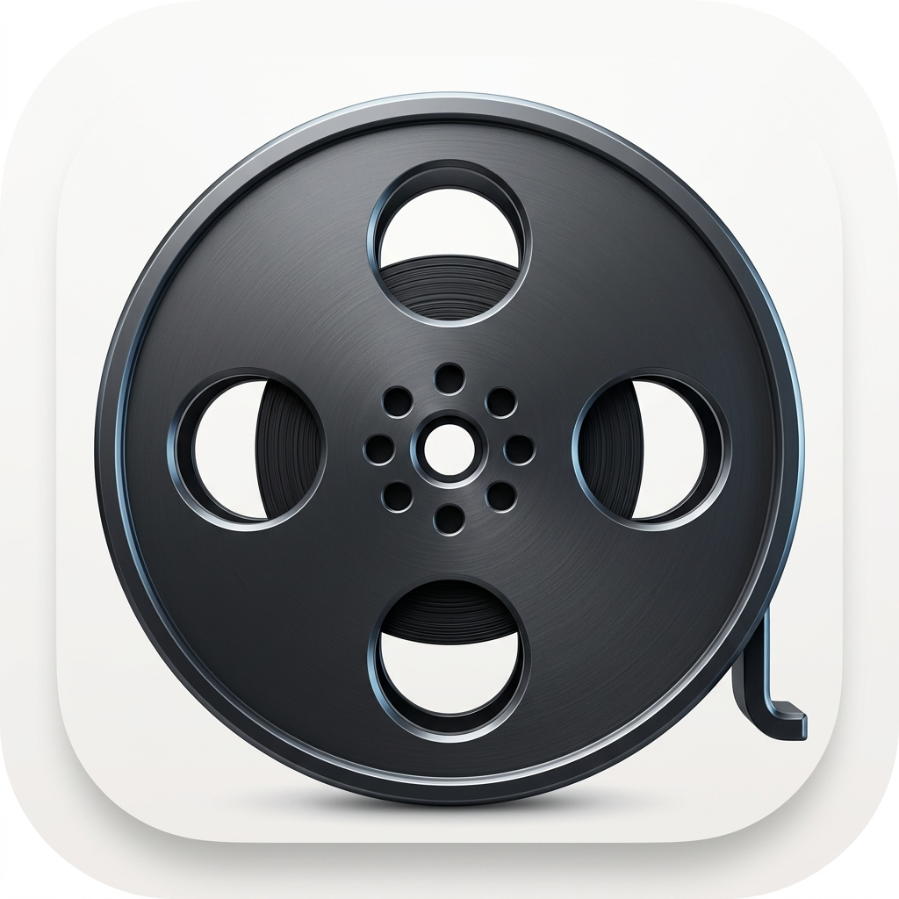

# Pickd

Stop scrolling. Start watching. Pickd is a premium, mood-based movie discovery app built with Flutter and Supabase. 

## 🎬 Features
- **Mood-Based Discovery:** Get instant recommendations tailored precisely to your current vibe.
- **Tinder-Style Swiping:** Swipe right to add to your watchlist, left to pass.
- **Premium Dark UI:** Designed with a stunning, high-contrast, edge-to-edge cinematic aesthetic.
- **Cross-Device Sync:** Supabase handles secure authentication and instant cloud sync across your devices.
- **Offline Mode:** Powered by Hive, ensuring ultra-fast local caching and responsiveness.

## 🚀 Download
Check out the **Releases** tab to download the latest `.apk` and test it on your Android device!

This project is a starting point for a Flutter application.

A few resources to get you started if this is your first Flutter project:

- [Lab: Write your first Flutter app](https://docs.flutter.dev/get-started/codelab)
- [Cookbook: Useful Flutter samples](https://docs.flutter.dev/cookbook)

For help getting started with Flutter development, view the
[online documentation](https://docs.flutter.dev/), which offers tutorials,
samples, guidance on mobile development, and a full API reference.
