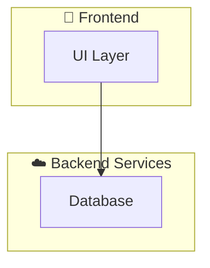

<a id="readme-top"></a>

<!-- PROJECT SHIELDS -->
<!-- Find badges here: https://shields.io/ -->
<div align="center">
  
  
  
  
</div>

<!-- PROJECT LOGO -->
<br />
<div align="center">
  <a href="https://github.com/YOUR_GITHUB_USERNAME/YOUR_REPO_NAME">
    
  </a>

  <h3 align="center">Project Name</h3>

  <p align="center">
    <strong>A catchy slogan for your project goes here.</strong>
    <br />
    A brief, 1-2 sentence description of what your app actually does and who it's for.
    <br />
    <br />
    <a href="https://github.com/YOUR_GITHUB_USERNAME/YOUR_REPO_NAME/releases"><strong>Download App »</strong></a>
    <br />
    <br />
    <a href="https://github.com/YOUR_GITHUB_USERNAME/YOUR_REPO_NAME/issues">Report Bug</a>
    ·
    <a href="https://github.com/YOUR_GITHUB_USERNAME/YOUR_REPO_NAME/issues">Request Feature</a>
  </p>
</div>

---

<!-- TABLE OF CONTENTS -->
<details>
  <summary>Table of Contents</summary>
  <ol>
    <li>
      <a href="#about-the-project">About The Project</a>
      <ul>
        <li><a href="#app-preview">App Preview</a></li>
        <li><a href="#built-with">Built With</a></li>
      </ul>
    </li>
    <li>
      <a href="#getting-started">Getting Started</a>
      <ul>
        <li><a href="#prerequisites">Prerequisites</a></li>
        <li><a href="#installation">Installation</a></li>
      </ul>
    </li>
    <li><a href="#features--usage">Features & Usage</a></li>
    <li><a href="#architecture">Architecture</a></li>
    <li><a href="#roadmap">Roadmap</a></li>
    <li><a href="#contributing">Contributing</a></li>
    <li><a href="#license">License</a></li>
    <li><a href="#acknowledgments">Acknowledgments</a></li>
  </ol>
</details>

---

<!-- ABOUT THE PROJECT -->
## About The Project

Write a 2-3 paragraph summary of why this project exists. What problem does it solve? Why is it better than the alternatives? What was your motivation for building it?

<p align="right">(<a href="#readme-top">back to top</a>)</p>

### App Preview

| Screen 1 | Screen 2 | Screen 3 |
|:---:|:---:|:---:|
|  |  |  |

<p align="right">(<a href="#readme-top">back to top</a>)</p>

### Built With

This project is built using modern frameworks and robust backend services.

* 
* 

<p align="right">(<a href="#readme-top">back to top</a>)</p>

---

<!-- GETTING STARTED -->
## Getting Started

To get a local copy up and running, follow these simple steps.

### Prerequisites

Make sure you have the following installed on your machine:
* [Flutter SDK](https://docs.flutter.dev/get-started/install)
* [Dart SDK](https://dart.dev/get-dart)

### Installation

1. **Clone the repo**
   ```sh
   git clone https://github.com/YOUR_GITHUB_USERNAME/YOUR_REPO_NAME.git
   ```
2. **Navigate into the directory**
   ```sh
   cd YOUR_REPO_NAME
   ```
3. **Install Flutter packages**
   ```sh
   flutter pub get
   ```
4. **Configure Environment Variables**
   Rename the `.env.example` file to `.env` and enter your API keys.
5. **Run the App**
   ```sh
   flutter run
   ```

<p align="right">(<a href="#readme-top">back to top</a>)</p>

---

<!-- USAGE EXAMPLES -->
## Features & Usage

| Feature | Description |
| :--- | :--- |
| ⚡ **Feature One** | Description of your cool feature here. |
| 🎨 **Feature Two** | Description of your cool feature here. |

<p align="right">(<a href="#readme-top">back to top</a>)</p>

---

<!-- ARCHITECTURE -->
## Architecture



<p align="right">(<a href="#readme-top">back to top</a>)</p>

---

<!-- ROADMAP -->
## Roadmap

- [x] Initial Release
- [ ] Feature 1
- [ ] Feature 2

See the [open issues](https://github.com/YOUR_GITHUB_USERNAME/YOUR_REPO_NAME/issues) for a full list of proposed features (and known issues).

<p align="right">(<a href="#readme-top">back to top</a>)</p>

---

<!-- CONTRIBUTING -->
## Contributing

Contributions are what make the open source community such an amazing place to learn, inspire, and create. Any contributions you make are **greatly appreciated**.

If you have a suggestion that would make this better, please fork the repo and create a pull request. You can also simply open an issue with the tag "enhancement".

1. Fork the Project
2. Create your Feature Branch (`git checkout -b feature/AmazingFeature`)
3. Commit your Changes (`git commit -m 'Add some AmazingFeature'`)
4. Push to the Branch (`git push origin feature/AmazingFeature`)
5. Open a Pull Request

<p align="right">(<a href="#readme-top">back to top</a>)</p>

---

<!-- LICENSE -->
## License

Distributed under the MIT License. See `LICENSE` for more information.

<p align="right">(<a href="#readme-top">back to top</a>)</p>

---

<!-- ACKNOWLEDGMENTS -->
## Acknowledgments

* [Resource 1](https://example.com)
* [Resource 2](https://example.com)

<p align="right">(<a href="#readme-top">back to top</a>)</p>
